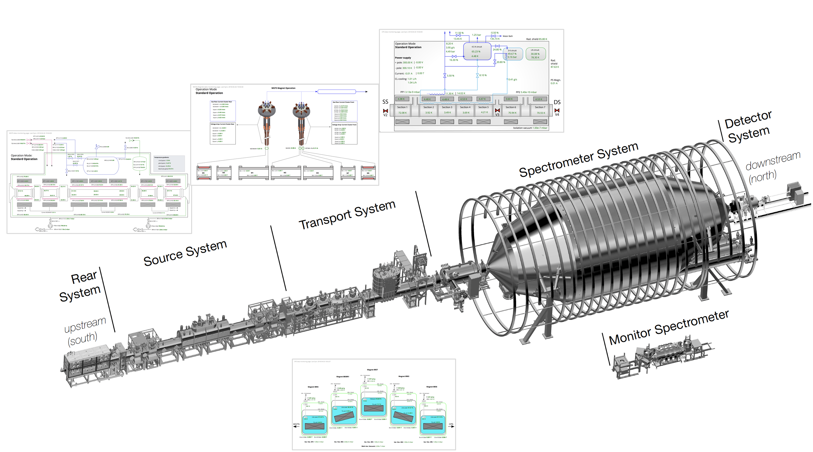
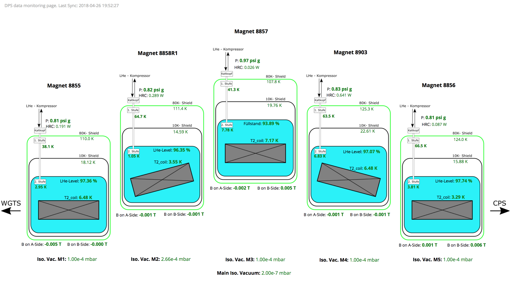
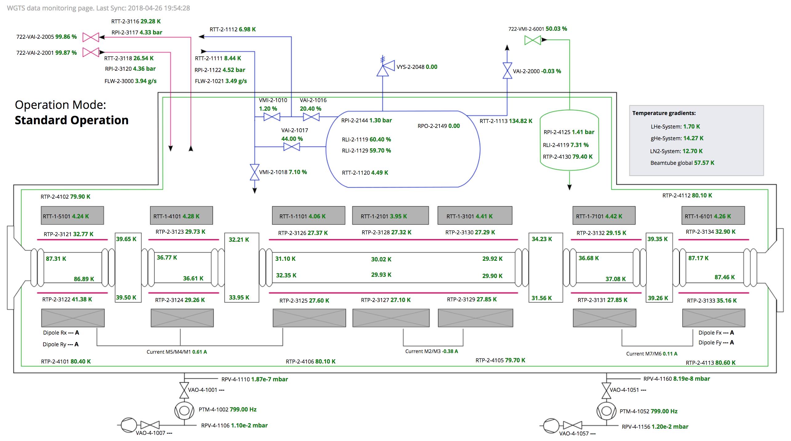
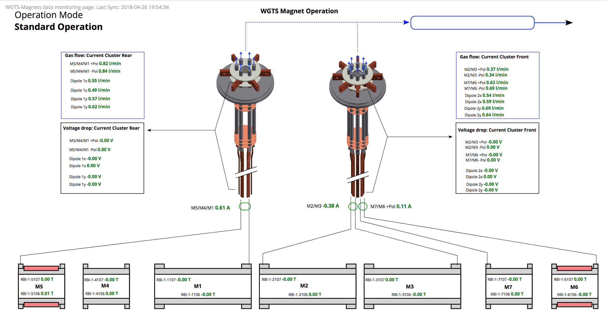

# BORA: A Personalized Data Display for Large-scale Experiments
 

  

<!-- PROJECT SHIELDS -->
<!--
*** I'm using markdown "reference style" links for readability.
*** Reference links are enclosed in brackets [ ] instead of parentheses ( ).
*** See the bottom of this document for the declaration of the reference variables
*** for contributors-url, forks-url, etc. This is an optional, concise syntax you may use.
*** https://www.markdownguide.org/basic-syntax/#reference-style-links
-->
[![Contributors][contributors-shield]][contributors-url]
[![Forks][forks-shield]][forks-url]
[![Stargazers][stars-shield]][stars-url]
[![Issues][issues-shield]][issues-url]
[![MIT License][license-shield]][license-url]
[![LinkedIn][linkedin-shield]][linkedin-url]

<!-- PROJECT LOGO -->
 

## What is BORA?
BORA is an open source visualization framework supporting large-scale experiments by generating personalized data displays and enabling the human-in-the-loop concept within the experiment. Despite the complex experiment setup, BORA allows scientists to build their desired data displays with no programming knowledge. There are two facets to the framework, with the first facet being a read-only data displays where it helps scientists to monitor the health of the experiment subsystems. The second facet enables scientists to control the systems and data acquisition parameters. It enables feedback for multiple data processing pipelines that interact with the large volume of data in real-time. Bora is built around RESTful APIs and offers support for various standard protocols through plugin extensions for databases (e.g., Redis) and for control protocols (e.g., OPC). Furthermore, we implemented experiment-specific protocols used in our projects, such as ORCA. One unique feature of BORA is that it supports video streaming analysis of experimental data, allowing visual representation of the subsystem, e.g., surface temperature monitoring, detector heatmap.

<!-- TABLE OF CONTENTS -->

  
Table of Contents

  <ol>
    <li>
      <a href="#getting-started">Getting Started</a>
    <!--
      <ul>
        <li><a href="#prerequisites">Prerequisites</a></li>
        <li><a href="#installation">Installation</a></li>
      </ul>
    </li>
    -->
    <li><a href="#gallery">Gallery</a></li>
    <li><a href="#roadmap">Roadmap</a></li>
    <li><a href="#contributing">Contributing</a></li>
    <li><a href="#license">License</a></li>
    <li><a href="#contact">Contact</a></li>
    <li><a href="#acknowledgments">Acknowledgments</a></li>
  </ol>

## Prerequisite

Please start a separate redis database

    $ docker run -p 6379:6379 -it --rm redislabs/redistimeseries

## Getting Started

    $ mkdir new_bora

    $ cd new_bora

    $ git clone https://github.com/kit-ipe/bora.git

    $ python -m venv env

    $ source env/bin/activate

    (env)$ pip install -r bora/requirements.txt

    (env)$ python bora/start.py
    Enter the new title: slope
    Enter the new port: 8000
    Settings updated successfully!
    Bora repository already cloned.
    Do you want to use the default background image provided? (Enter 'yes' for default, or enter 'no' to provide your own image path): yes
    Using default background image.

    (env)$ python bora/core.py

Now launch http://localhost:8000 to see the BORA page, to add widgets, go to http://localhost:8000/designer

<!--
### Prerequisites

TODO

### Installation

TODO

(<a href="#readme-top">back to top</a>)

-->

<!-- USAGE EXAMPLES -->
## Gallery

  

  

  

  

(<a href="#readme-top">back to top</a>)

<!-- ROADMAP -->
## Roadmap

- [ ] Add BORA 1.0 visual widgets
- [ ] Add documentations

See the [open issues](https://github.com/kit-ipe/bora/issues) for a full list of proposed features (and known issues).

(<a href="#readme-top">back to top</a>)

<!-- CONTRIBUTING -->
## Contributing

Contributions are what make the open source community such an amazing place to learn, inspire, and create. Any contributions you make are **greatly appreciated**.

If you have a suggestion that would make this better, please fork the repo and create a pull request. You can also simply open an issue with the tag "enhancement".
Don't forget to give the project a star! Thanks again!

1. Fork the Project
2. Create your Feature Branch (`git checkout -b feature/AmazingFeature`)
3. Commit your Changes (`git commit -m 'Add some AmazingFeature'`)
4. Push to the Branch (`git push origin feature/AmazingFeature`)
5. Open a Pull Request

We follow the guidelines and conventions below:

1. [Javascript - Mozilla](https://developer.mozilla.org/en-US/docs/MDN/Writing_guidelines/Writing_style_guide/Code_style_guide/JavaScript)
2. [HTML - Mozilla](https://developer.mozilla.org/en-US/docs/MDN/Writing_guidelines/Writing_style_guide/Code_style_guide/HTML)
3. [CSS - Mozilla](https://developer.mozilla.org/en-US/docs/MDN/Writing_guidelines/Writing_style_guide/Code_style_guide/CSS)
4. [Python - PEP8](https://peps.python.org/pep-0008/)

(<a href="#readme-top">back to top</a>)

<!-- LICENSE -->
## License

Distributed under the MIT License. See `LICENSE.txt` for more information.

(<a href="#readme-top">back to top</a>)

<!-- CONTACT -->
## Contact

Nicholas Tan Jerome - nicholas.tanjerome@kit.edu

(<a href="#readme-top">back to top</a>)

<!-- ACKNOWLEDGMENTS -->
## Acknowledgments

* [The KATRIN Experiment](https://www.katrin.kit.edu/index.php)

(<a href="#readme-top">back to top</a>)

<!-- MARKDOWN LINKS & IMAGES -->
<!-- https://www.markdownguide.org/basic-syntax/#reference-style-links -->
[contributors-shield]: https://img.shields.io/github/contributors/kit-ipe/bora.svg?style=for-the-badge
[contributors-url]: https://github.com/kit-ipe/bora/graphs/contributors
[forks-shield]: https://img.shields.io/github/forks/kit-ipe/bora.svg?style=for-the-badge
[forks-url]: https://github.com/kit-ipe/bora/network/members
[stars-shield]: https://img.shields.io/github/stars/kit-ipe/bora.svg?style=for-the-badge
[stars-url]: https://github.com/kit-ipe/bora/stargazers
[issues-shield]: https://img.shields.io/github/issues/kit-ipe/bora.svg?style=for-the-badge
[issues-url]: https://github.com/kit-ipe/bora/issues
[license-shield]: https://img.shields.io/github/license/kit-ipe/bora.svg?style=for-the-badge
[license-url]: https://github.com/kit-ipe/bora/blob/master/LICENSE.txt
[linkedin-shield]: https://img.shields.io/badge/-LinkedIn-black.svg?style=for-the-badge&logo=linkedin&colorB=555
[linkedin-url]: https://www.linkedin.com/in/nicholastanjerome/
